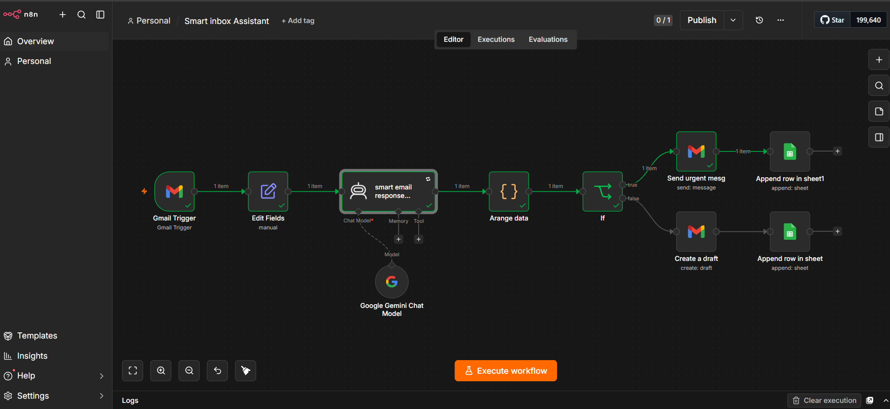
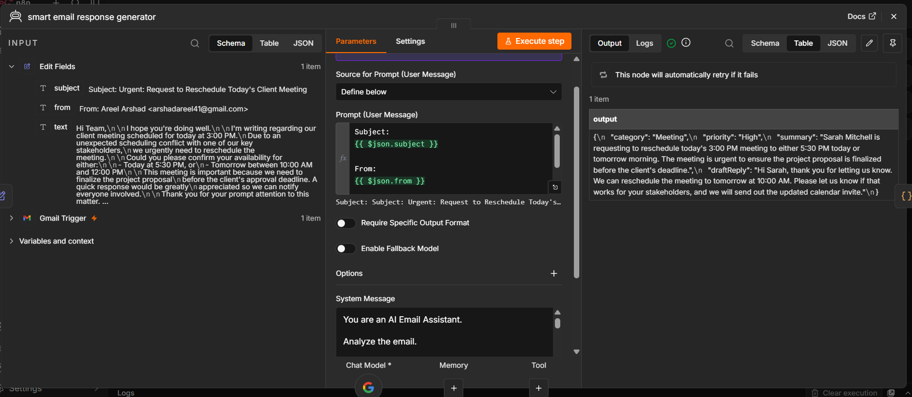
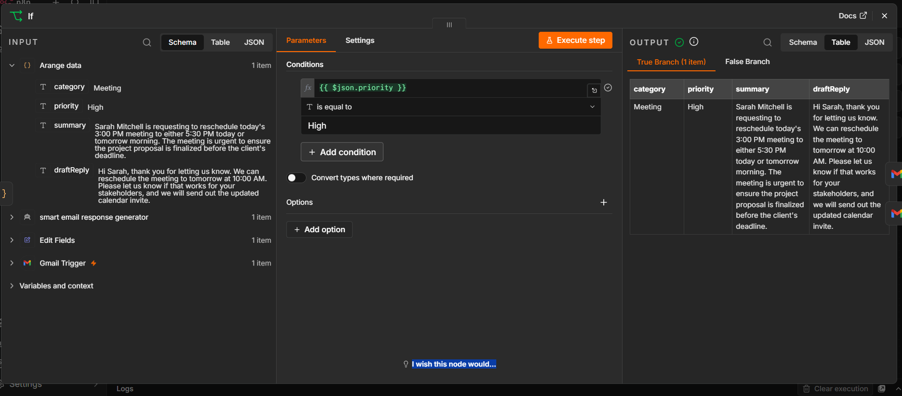
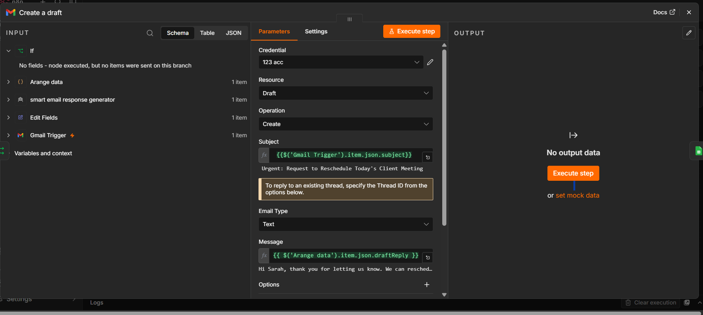
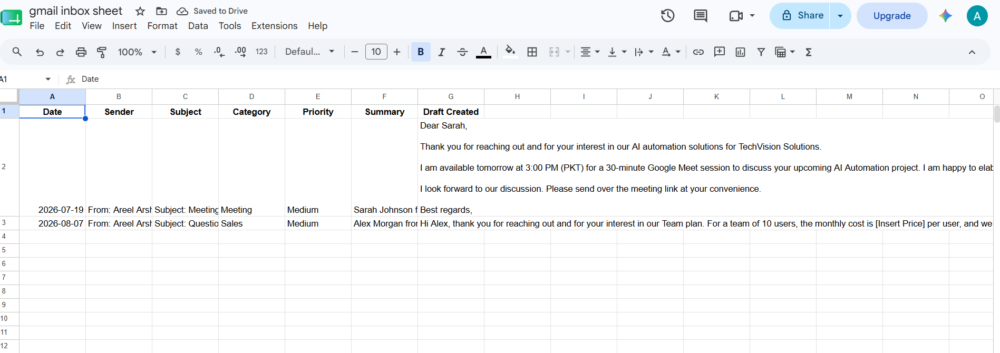
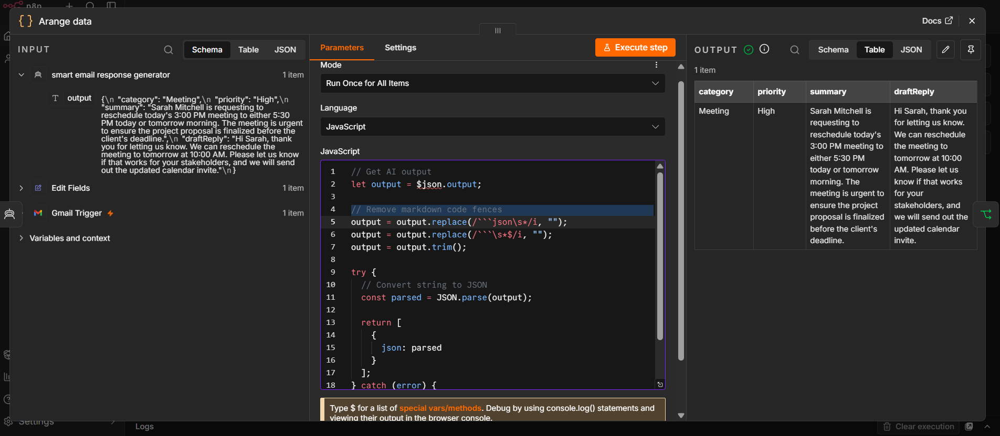

# 📧 Smart Inbox Assistant – AI Email Automation with n8n


# Description 
An AI-powered email automation workflow built with **n8n** that automatically analyzes incoming Gmail messages, classifies emails by category and priority, generates professional draft replies using an AI Agent, routes urgent emails for immediate action, and logs all processed emails into Google Sheets.

## 📑 Table of Contents

- [📌 Project Information](#-project-information)
- [🎯 Project Overview](#-project-overview)
- [❗ Problem Statement](#-problem-statement)
- [💡 Solution](#-solution)
- [🏗️ Workflow Architecture](#️-workflow-architecture)
- [✨ Features](#-features)
- [🤖 AI Agent Prompt](#-ai-agent-prompt)
- [⚙️ Workflow Explanation](#️-workflow-explanation)
- [📸 Screenshots](#-screenshots)
- [🎥 Demo](#-demo)
- [🛠️ Tech Stack](#️-tech-stack)
- [📂 Folder Structure](#-folder-structure)
- [🚀 Installation](#-installation)
- [⚙️ Configuration](#️-configuration)
- [▶️ Usage](#️-usage)
- [📊 Google Sheet Structure](#-google-sheet-structure)
- [🔮 Future Improvements](#-future-improvements)
- [👨‍💻 Author](#-author)
- [📄 License](#-license)

## 📌 Project Information

| Project | Details |
|----------|---------|
| Project Name | Smart Inbox Assistant |
| Platform | n8n |
| Category | AI Email Automation |
| Difficulty | Intermediate |
| AI Model | Google Gemini |
| Trigger | Gmail Trigger |
| Integrations | Gmail, Google Sheets |
| Status | Completed |

## 🎯 Project Overview

Managing emails manually can be time-consuming, especially when important messages need immediate attention while less urgent emails can wait. Businesses and professionals often spend valuable time reading, categorizing, prioritizing, and replying to emails.

The **Smart Inbox Assistant** is an AI-powered automation workflow built with **n8n** that intelligently processes incoming Gmail messages. Using an AI Agent, it automatically classifies each email, assigns a priority level, generates a professional draft reply, routes urgent emails for immediate action, and logs all processed emails into Google Sheets.

This workflow demonstrates how AI and workflow automation can work together to reduce repetitive tasks, improve response times, and streamline email management.

## ❗ Problem Statement

Managing emails manually can quickly become overwhelming, especially when inboxes receive a high volume of messages every day. Users must spend time opening each email, understanding its purpose, determining its urgency, drafting replies, and organizing important conversations.

This repetitive process increases response time, reduces productivity, and increases the risk of overlooking high-priority emails. Businesses and professionals need an efficient solution that can intelligently process emails while reducing manual effort.

## 💡 Solution

The Smart Inbox Assistant automates the complete email processing workflow using AI and n8n.
Whenever a new email arrives in Gmail, the workflow automatically:

- Detects the incoming email.
- Extracts the required email information.
- Uses an AI Agent to analyze the email content.
- Classifies the email into an appropriate category.
- Assigns a priority level (High,Medium, or Low).
- Generates a professional draft reply.
- Sends urgent emails for immediate attention or saves non-urgent replies as drafts.
- Logs every processed email into Google Sheets for tracking and record keeping.

This automation reduces manual effort, improves response consistency, and ensures that important emails receive immediate attention.

## 🏗️ Workflow Architecture

The Smart Inbox Assistant follows a structured automation pipeline that combines Gmail, AI, conditional logic, and Google Sheets to process incoming emails efficiently.

The workflow receives every new Gmail message, extracts the required information, uses an AI Agent to analyze the content, determines the email category and priority, generates a professional draft reply, routes the email based on its priority, and finally records the processed email information in Google Sheets.

## 📊 Workflow Flow

```text
New Email (Gmail)
        │
        ▼
 Gmail Trigger
        │
        ▼
  Edit Fields
        │
        ▼
    AI Agent
(Classify & Prioritize)
        │
        ▼
   Code Node
(Parse AI JSON)
        │
        ▼
     IF Node
     │      │
     │      │
 High   Medium / Low
     │          │
     ▼          ▼
Send Email   Create Draft
     │          │
     └────┬─────┘
          ▼
 Google Sheets
```

## ⚙️ Workflow Explanation

| Step | Node | Purpose |
|------|------|---------|
| 1 | Gmail Trigger | Detects every new incoming Gmail message. |
| 2 | Edit Fields | Extracts and formats the required email information. |
| 3 | AI Agent | Analyzes the email, assigns a category and priority, generates a summary, and creates a professional draft reply. |
| 4 | Code | Parses and validates the AI-generated JSON output. |
| 5 | IF | Routes emails according to their priority level. |
| 6 | Gmail | Sends urgent emails immediately or creates draft replies for medium and low priority emails. |
| 7 | Google Sheets | Stores processed email details for tracking and reporting. |

## 📸 Workflow Architecture



## ✨ Features

- 📧 Automatically detects new incoming Gmail messages.
- 🤖 Uses an AI Agent to analyze email content.
- 🏷️ Classifies emails into categories (Sales, Support, Meeting, Billing, Personal, Spam, or Other).
- 🚦 Assigns priority levels (High, Medium, or Low) based on predefined rules.
- 📝 Generates professional, AI-powered draft replies.
- 🚀 Sends high-priority emails for immediate attention.
- 📄 Creates draft replies for medium- and low-priority emails.
- 📊 Logs processed email details into Google Sheets.
- ⚡ Reduces manual email management and improves response efficiency.
- 🔄 Built with a modular workflow that is easy to extend and customize.

## 🤖 AI Agent

At the core of this workflow is an AI Agent responsible for intelligently processing incoming emails. The AI analyzes each email's content, determines its category and priority, generates a concise summary, and prepares a professional draft reply.

By combining natural language understanding with workflow automation, the Smart Inbox Assistant reduces manual effort while ensuring consistent and accurate email handling.

## 🧠 AI Prompt Design

The AI Agent is guided by a structured system prompt that ensures every email is processed consistently.

The prompt instructs the AI to:

- Analyze the email content.
- Categorize the email.
- Assign a priority level.
- Generate a concise summary.
- Create a professional draft reply.
- Return the output as valid JSON for downstream automation.

This structured approach ensures reliable integration with subsequent workflow nodes.

## 📦 JSON Response Format

The AI Agent returns the following JSON structure:

```json
{
  "category": "",
  "priority": "",
  "summary": "",
  "draftReply": ""
}
```
## 📸 Screenshots

### 🔹 Complete Workflow

The complete n8n workflow showing the end-to-end email automation process.


---

### 🔹 AI Agent Configuration

The AI Agent analyzes every incoming email, classifies its category and priority, and generates a professional draft reply.




---

### 🔹 Priority Decision (IF Node)

The IF node checks the AI-generated priority level and routes the email accordingly.



---

### 🔹 Gmail Action

High-priority emails are sent immediately, while Medium- and Low-priority emails are saved as drafts.




---

### 🔹 Google Sheets Log

Every processed email is automatically logged into Google Sheets for tracking and reporting.


---

### 🔹 Code Node

The Code node parses and validates the AI-generated JSON output, ensuring that category, priority, summary, and draft reply are correctly structured before the workflow continues.



## 🎥 Demo

The GIF below demonstrates the Smart Inbox Assistant processing an incoming email from start to finish.


## Workfloe json

The complete n8n workflow is included in this repository and can be imported directly into n8n.

Location:

[workflow-file](workflow-file/workflow.json)

## 📁 Folder Structure

```text
Smart-Inbox-Assistant/
│
├── README.md
├── LICENSE
├── .gitignore
│
├── workflow-file/
│   └── workflow.json
│
├── screenshots/
│   ├── workflow.png
│   ├── ai-agent.png
│   ├── gmail-trigger.png
│   └── google-sheet.png
│
├── assets/
│   └──workflowdemo.gif
│
└── docs/
```

## 🚀 Installation

### 1. Clone the repository

```bash
git clone https://github.com/buildwithareel/smart-inbox-assistant-n8n.git
```

### 2. Open n8n

Start your local or cloud n8n instance.

### 3. Import the workflow

Import:

```text
workflow/smart-inbox-assistant.json
```

### 4. Configure credentials

Add your:

- Gmail account
- Google Sheets account
- Google Gemini API / AI credential

### 5. Activate the workflow

Enable the workflow to start processing incoming emails.